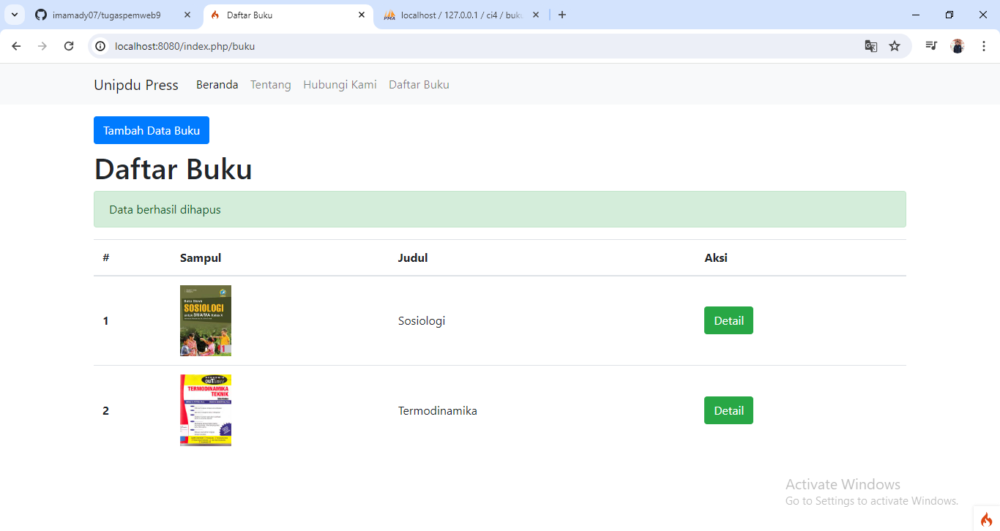

# tugaspemweb9
# hasil screenshoot

## Validasi Data
- 1. Data Awal

- 2. Validasi tambah data jika Data kosong

- 3. Validasi tambah data jika Data sudah ada

## Delete Data
- 4. Database Awal

- 5. Validasi delete

- 6. Data di hapus

- 7. Database

